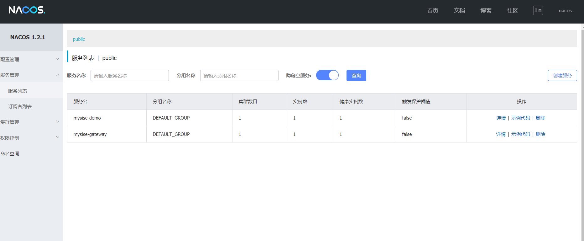
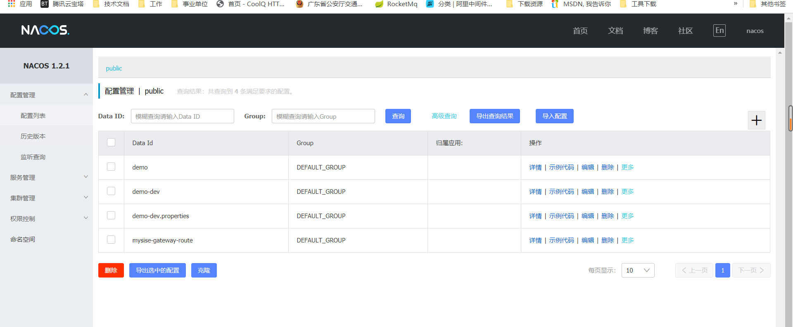
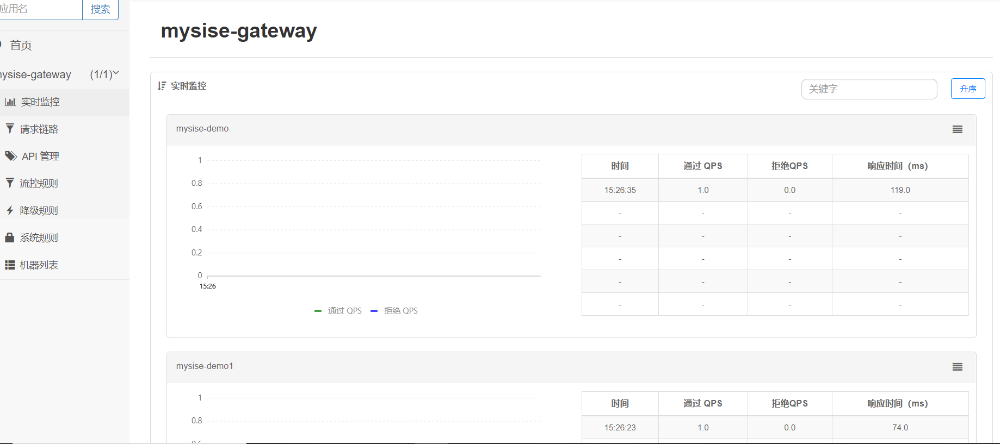
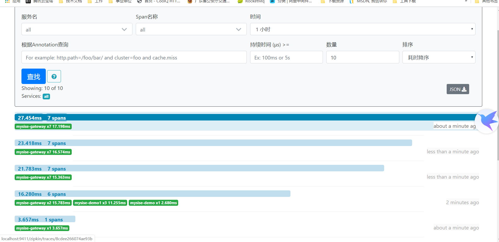
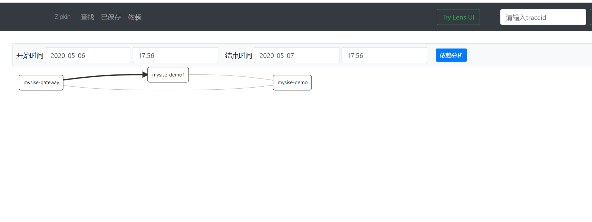

# **mysise-sca**
基于Spring cloud alibaba 的微服务脚手架
   
* 网关：         spring-cloud-gateway（配置中心动态路由）               
* 注册中心：     spring-cloud-alibaba-nacos
* 配置中心：     spring-cloud-alibaba-nacos
* 限流熔断       spring-cloud-alibaba-sentinel
* 链路追踪：     spring-cloud-starter-zipkin
* 分布式事务：   seata（未完成） 
* orm：         mybatis-plus  
* 认证/授权：    mysise-auth （未完成）   

  
  
  
  
  
  
  
  
  
  
  